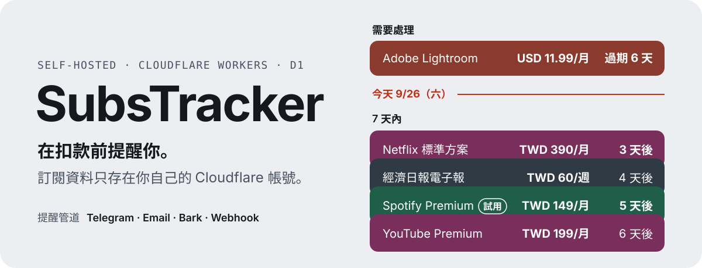
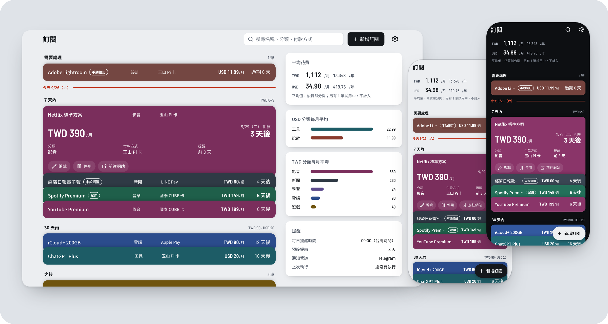

<p align="center">
  
</p>

SubsTracker 記錄每個訂閱的下次扣款日，並在扣款前透過 Telegram、Email、Bark 或 Webhook 提醒你。它部署在你自己的 Cloudflare 帳號：程式執行在 Workers，資料存在 D1，不經過第三方訂閱服務。

<p align="center">
  
</p>
<p align="center"><sub>首頁的桌機與手機畫面（淺色與深色）。畫面使用範例資料。</sub></p>

## 運作方式

1. 新增訂閱：金額、付款週期、下次扣款日。首頁依扣款日把卡片排成「需要處理」「7 天內」「30 天內」「之後」。
2. Cron 每小時執行一次。到了你的時區中的每日提醒時間，它找出在提醒天數內的訂閱。
3. 提醒送到你啟用的每個通知管道。自動續訂的訂閱在扣款日過後推進到下一個週期。

你用手機或桌機開啟同一個網址。app 可以安裝成 PWA，離線時顯示最後一次取得的資料。

## 部署

### 需求

- [Bun](https://bun.sh/)
- Node.js 22.18 以上
- Cloudflare 帳號

### 新安裝

1. 取得原始碼並安裝套件。

   ```bash
   git clone https://github.com/gn00678465/subs-tracker.git
   cd subs-tracker
   bun install
   ```

2. 在你的 Cloudflare 帳號建立資料庫。

   ```bash
   bunx wrangler d1 create subs-tracker --binding DB --update-config
   ```

3. 部署。這個指令建置 app、建立資料表，然後上傳到 Cloudflare。

   ```bash
   bun run deploy
   ```

4. 開啟 Worker 的網址，用 `admin` / `password` 登入。
5. 到設定頁的「帳號與登入」修改密碼。新密碼至少 8 個字元。

全新安裝的預設值：時區 `UTC`、每日提醒時間 09:00、預設提前 3 天、只提醒一次。到設定頁的「提醒」修改。

也可以用 Cloudflare Workers Builds：在 Cloudflare 連結你的 GitHub repo，推送到指定的分支時自動部署。

### 從 KV 版本升級

舊版把資料存在 Cloudflare KV。新版第一次開啟時，把 KV 的資料複製到 D1。

1. 確認 `wrangler.toml` 中 KV 的 `id` 是舊版使用的 KV。
2. 執行「新安裝」的步驟 2 與 3。
3. 開啟 app 一次，或等下一次排程。訂閱、設定與 passkey 會複製到 D1。

複製時不修改、不刪除 KV 的資料。舊的帳號與密碼仍然可以使用。

## 功能

### 訂閱

- 每筆訂閱記錄名稱、金額、貨幣、付款週期（每 N 天、週、月、年）與下次扣款日。
- 選填欄位：分類、付款方式、網站、開始日、備註、取消期限。
- 「自動續訂」開啟時，下次扣款日過了以後，排程把日期推進到下一個週期。
- 「自動續訂」關閉時，卡片顯示「已續訂」按鈕。按下後，下次扣款日推進一個週期。
- 「試用中」開啟時，提醒內容改為試用結束。試用的金額不計入花費摘要。
- 設了取消期限時，提醒依取消期限計算。
- 可以停用訂閱。停用的訂閱不送提醒。

### 首頁

- 卡片依下次扣款日排序，分成「需要處理」「7 天內」「30 天內」「之後」「已停用」。
- 花費摘要依貨幣分開，顯示每月與每年的平均金額。
- 搜尋比對名稱、分類、付款方式與備註。
- 沒有啟用通知管道，或上次排程有管道發送失敗時，頁面頂部顯示警告。
- 新增與編輯使用同一個表單。
- 桌機寬度（1024px 以上）多一個側欄：花費摘要、各分類的每月平均、提醒狀態。

### 提醒

- 每筆訂閱的提醒可以選「沿用預設」「不提醒」或提前的天數。
- 提醒頻率有兩種：「只提醒一次」，或每天提醒直到扣款日。
- 排程每小時執行一次。只有在你的時區中到了每日提醒時間，排程才送出提醒。

### 登入

- 使用者名稱與密碼登入。
- Passkey 登入：使用「使用 passkey 登入」按鈕，或使用瀏覽器的自動填入。
- 新增 passkey、刪除 passkey、修改帳號前，你必須在 10 分鐘內登入過。超過 10 分鐘時，頁面要求你再輸入一次密碼或完成一次 passkey 驗證。

### 設定

設定頁分成以下幾段。每一段各自儲存。

- 提醒：每日提醒時間、時區、預設提前天數、提醒頻率。
- 通知管道：Telegram、Email、Bark、Webhook。每個管道都有「傳送測試」。
- 帳號與登入：使用者名稱、密碼、passkey、登出。
- 資料：「匯出 JSON」下載所有訂閱與設定。匯出檔不含密碼、passkey 與通知管道的憑證。
- 外觀：主題可選「跟隨系統」「淺色」「深色」。主題只存在目前的瀏覽器。

### 離線

離線時，頁面顯示最後一次取得的訂閱與設定，不能新增、編輯、刪除或儲存。登出時，app 刪除這些暫存的資料。

## 通知管道設定

到設定頁的「通知管道」，點開一個管道：

1. 打開「啟用」開關。
2. 填寫必要欄位。進階欄位在「進階」區塊內。
3. 按「傳送測試」。測試使用表單中目前的值，不必先儲存。
4. 按「儲存」。

必要欄位沒有值時，管道不能啟用。

### Telegram

必要欄位：Bot Token、Chat ID。

1. 在 Telegram 開啟 `@BotFather`，傳送 `/newbot`，取得 Bot Token。
2. 傳送任意訊息給你的 Bot。
3. 開啟 `https://api.telegram.org/bot<BOT_TOKEN>/getUpdates`。回應中 `"chat":{"id":...}` 的數字是 Chat ID。

### Email（Resend）

必要欄位：Resend API Key、寄件地址、收件地址。進階欄位：寄件人名稱。

1. 註冊 [Resend](https://resend.com/)，在 Dashboard 建立 API Key。
2. 用自己的網域寄信時，先在 Resend 驗證這個網域。

### Bark（iOS）

必要欄位：裝置 Key。進階欄位：伺服器（預設 `https://api.day.app`）、保存到 Bark 歷史紀錄、查詢參數（例如 `sound=alarm&group=訂閱`）。

1. 從 App Store 安裝 [Bark](https://apps.apple.com/app/bark-customed-notifications/id1403753865)。
2. 開啟 Bark，複製推送網址 `https://api.day.app/<KEY>/` 中的 `<KEY>`。

### Webhook

必要欄位：網址。進階欄位：

- 方法：`POST`（預設）、`PUT` 或 `GET`。`GET` 不送出內容。
- 標頭（JSON），例如 `{"Authorization": "Bearer …"}`。
- 內容範本（JSON）。可用的變數是 `{{title}}`、`{{content}}`、`{{timestamp}}`。

沒有填寫內容範本時，Worker 送出：

```json
{ "title": "{{title}}", "content": "{{content}}", "timestamp": "{{timestamp}}" }
```

## 開發

本機開發、API、提醒排程的實作與專案結構，見 [CONTRIBUTING.md](CONTRIBUTING.md)。
